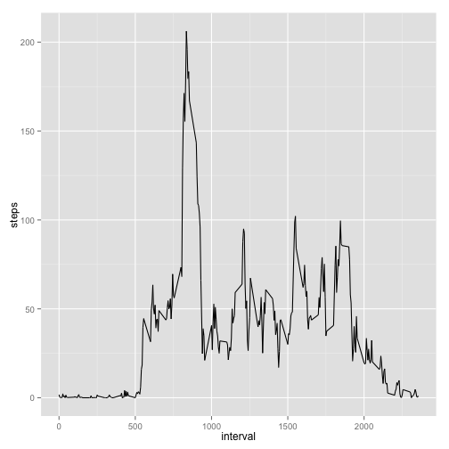
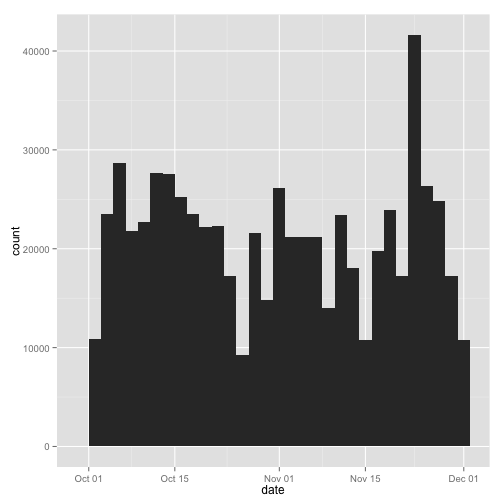

# Reproducible Research: Peer Assessment 1


## Loading and preprocessing the data

Download the file, extract activity.csv and load the data into the activity dataframe


```r
download.file("https://d396qusza40orc.cloudfront.net/repdata%2Fdata%2Factivity.zip", destfile = "activity.zip", method = "curl")
unzip("activity.zip")
activity <- read.csv("./activity.csv")
activity$date <- as.Date(activity$date)
```


## What is mean total number of steps taken per day?

A histogram for the daily steps taken


```r
library(ggplot2)
q<-qplot(date, weight = activity$steps, data = activity, geom = "histogram")
print(q)
```

```
## stat_bin: binwidth defaulted to range/30. Use 'binwidth = x' to adjust this.
```

 

```r
mean(tapply(activity$steps, activity$date, sum, na.rm = TRUE))
```

```
## [1] 9354
```

```r
median(tapply(activity$steps, activity$date, sum, na.rm = TRUE))
```

```
## [1] 10395
```


## What is the average daily activity pattern?

Avg number of steps: 5-minute interval time series


```r
averageSteps <- data.frame(cbind(activity$interval,tapply(activity$steps, activity$interval, mean, na.rm = TRUE)))
colnames(averageSteps) <- c("interval", "steps")
print(ggplot(data = averageSteps,aes(x = interval, y = steps)) + geom_line())
```

 

```r
maxTime <- averageSteps[which.max(averageSteps$steps), "interval"]
strftime(as.POSIXct(Sys.Date()) + as.difftime(round(maxTime/100), units = "hours") + as.difftime(maxTime%%100, units = "mins"), "%r", tz="UTC")
```

```
## [1] "08:35:00 am"
```


## Imputing missing values

Replace the missing values with averages


```r
sum(is.na(activity$steps))
```

```
## [1] 2304
```

```r
cleanData <- activity
cleanData[is.na(cleanData[, 1]), 1] <- averageSteps[is.na(cleanData[, 1]),2]
```

A histogram of the clean data


```r
qplot(date, weight = cleanData$steps, data = cleanData, geom = "histogram")
```

```
## stat_bin: binwidth defaulted to range/30. Use 'binwidth = x' to adjust this.
```

 

```r
mean(tapply(cleanData$steps, cleanData$date, sum, na.rm = TRUE))
```

```
## [1] 10766
```

```r
median(tapply(cleanData$steps, cleanData$date, sum, na.rm = TRUE))
```

```
## [1] 10766
```


## Are there differences in activity patterns between weekdays and weekends?

Append "Weekend" or "Weekday" to a new field and plot the average of steps taken


```r
library(lattice)
cleanData$day <- as.factor(ifelse(weekdays(cleanData$date) %in% c("Saturday", "Sunday"), "Weekend", "Weekday"))
xyplot(steps ~ interval | day, aggregate(steps ~ interval + day, cleanData, FUN = mean), layout = c(1, 2), type = "l", group = day)
```

 
