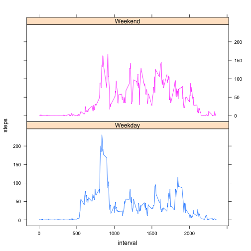

# Reproducible Research: Peer Assessment 1


## Loading and preprocessing the data

Download the file, extract activity.csv and load into the activity dataframe


```r
fileUrl <- "https://d396qusza40orc.cloudfront.net/repdata%2Fdata%2Factivity.zip"
download.file(fileUrl, destfile = "Dataset.zip", method = "curl")
unzip("Dataset.zip")
activity <- read.csv("./activity.csv")
activity$date <- as.Date(activity$date)
head(activity)
```

```
##   steps       date interval
## 1    NA 2012-10-01        0
## 2    NA 2012-10-01        5
## 3    NA 2012-10-01       10
## 4    NA 2012-10-01       15
## 5    NA 2012-10-01       20
## 6    NA 2012-10-01       25
```

```r
summary(activity)
```

```
##      steps            date               interval   
##  Min.   :  0.0   Min.   :2012-10-01   Min.   :   0  
##  1st Qu.:  0.0   1st Qu.:2012-10-16   1st Qu.: 589  
##  Median :  0.0   Median :2012-10-31   Median :1178  
##  Mean   : 37.4   Mean   :2012-10-31   Mean   :1178  
##  3rd Qu.: 12.0   3rd Qu.:2012-11-15   3rd Qu.:1766  
##  Max.   :806.0   Max.   :2012-11-30   Max.   :2355  
##  NA's   :2304
```

## What is mean total number of steps taken per day?

Daily step taken: histogram


```r
library(ggplot2)
q<-qplot(date, weight=activity$steps, data=activity, geom="histogram")
print(q)
```

```
## stat_bin: binwidth defaulted to range/30. Use 'binwidth = x' to adjust this.
```

 

Stats for the daily steps taken


```r
mean(tapply(activity$steps, activity$date, sum, na.rm = TRUE))
```

```
## [1] 9354
```

```r
median(tapply(activity$steps, activity$date, sum, na.rm = TRUE))
```

```
## [1] 10395
```

## What is the average daily activity pattern?

Avg number of steps: 5-minute interval time series


```r
averageSteps<-data.frame(cbind(activity$interval,tapply(activity$steps, activity$interval, mean, na.rm = TRUE)))
colnames(averageSteps) <- c("interval","steps")
q<-ggplot(data=averageSteps,aes(x=interval,y=steps)) +
  geom_line()
print(q)
```

 

An interval with the max number of steps taken


```r
maxTime<-averageSteps[which.max(averageSteps$steps),"interval"]
strftime( as.POSIXct(Sys.Date()) + as.difftime(round(maxTime/100), units="hours")+ as.difftime(maxTime%%100, units="mins"), "%r",tz="UTC")
```

```
## [1] "08:35:00 am"
```

## Imputing missing values

Number of missing values


```r
sum(is.na(activity$steps))
```

```
## [1] 2304
```

Replace the missing values with the mean value


```r
cleanData<-activity
cleanData[is.na(cleanData[, 1]), 1]<-averageSteps[is.na(cleanData[, 1]),2]
```

A histogram of the cleaned data


```r
qplot(date, weight=cleanData$steps, data=cleanData, geom="histogram")
```

```
## stat_bin: binwidth defaulted to range/30. Use 'binwidth = x' to adjust this.
```

 

Calculate and report the mean and media values. We can see that the values differ from the initial calculation, and have higher value. It is also observed in the graph above. Most days have an increased number of mean of steps, since the NAs have been replaced by the 5-minute interval mean.


```r
mean(tapply(cleanData$steps, cleanData$date, sum, na.rm = TRUE))
```

```
## [1] 10766
```

```r
median(tapply(cleanData$steps, cleanData$date, sum, na.rm = TRUE))
```

```
## [1] 10766
```

## Are there differences in activity patterns between weekdays and weekends?

Append "Weekend" or "Weekday" to a new field, conditionally.


```r
library(lattice)
cleanData$day <- as.factor(ifelse(weekdays(cleanData$date) %in% c("Saturday", "Sunday"), "Weekend", "Weekday"))
```

Plot the avg of steps


```r
xyplot(steps ~ interval | day, aggregate(steps ~ interval + day, cleanData, FUN = mean), layout = c(1, 2), type = "l", group = day)
```

 
